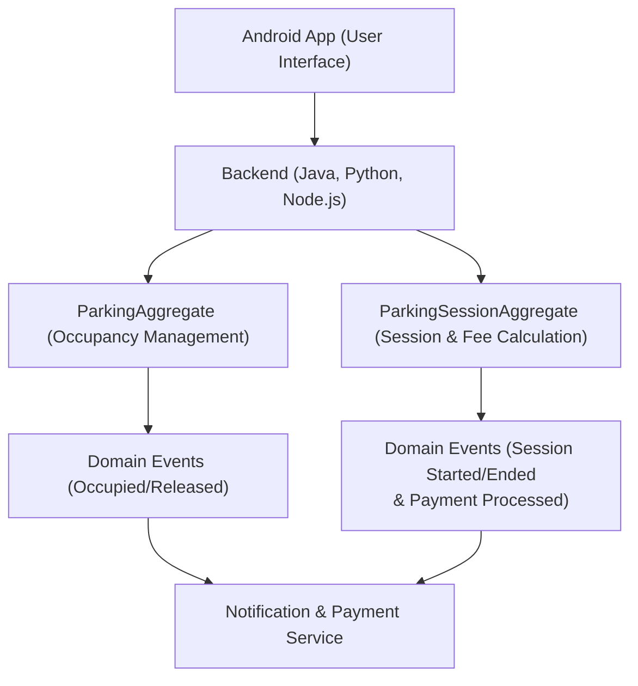

# Smart Parking System

The Smart Parking System is designed to alleviate the stress of finding available parking in enclosed lots. Our solution provides real-time parking information, navigation assistance, and automated vehicle logging through IoT sensors and camera systems. The system integrates a robust backend architecture based on aggregates and domain events to ensure a consistent and scalable solution.

---

## System Overview

- **User Interaction:**
  - **Selection:** Drivers choose a parking lot using an Android app.
  - **Information Display:** The app shows parking lot details including operating hours, occupancy status, available spot count, and the current number of viewers.
  - **Navigation:** Drivers receive real-time directions to the selected parking lot.
  - **Real-time Updates:** Notifications are sent if available parking spots decrease or become fully occupied.

- **On-site Operations:**
  - **Entry Logging:** Upon arrival, our camera system scans the license plate and logs the entry time.
  - **Spot Monitoring:** IoT sensors continuously monitor and update the status of each parking spot, which is visualized on the app.
  - **Exit Process:** When leaving, the camera system scans the license plate again to compute the parking fee, and the spot is marked as available.

---

## Aggregates and Domain Events

Aggregates encapsulate the core business logic and ensure data consistency, while domain events notify different parts of the system about key state changes.

### Aggregates

- **ParkingAggregate**
  - **Responsibilities:**
    - **Real-Time Monitoring:** Manage the current occupancy status of the parking lot using data from IoT sensors.
    - **State Transitions:** Mark spots as occupied or free based on sensor and camera inputs.
  - **Key Methods:**
    - `markSpotOccupied()`: Update a parking spot as occupied when a vehicle is detected.
    - `markSpotFree()`: Mark a spot as free when a vehicle exits.
    - `updateOccupancyStatus()`: Process real-time sensor data to maintain accurate occupancy metrics.

- **ParkingSessionAggregate**
  - **Responsibilities:**
    - **Session Management:** Manage the start and end of a parking session for each vehicle.
    - **Fee Calculation:** Compute the parking fee based on the time interval between entry and exit.
  - **Key Methods:**
    - `startSession()`: Log the entry time when the vehicle is detected at the gate.
    - `endSession()`: Log the exit time, compute the fee, and finalize the session.

### Domain Events

- **ParkingSpaceOccupiedEvent**
  - **Triggered When:** A sensor or camera confirms that a parking spot has become occupied.
  - **Usage:**  
    - Update the mobile app’s view to reflect reduced availability.
    - Trigger notifications if occupancy reaches a critical threshold.

- **ParkingSpaceReleasedEvent**
  - **Triggered When:** A parking spot is freed after a vehicle exits.
  - **Usage:**  
    - Update the dashboard and mobile app to show increased availability.
    - Recalculate the overall occupancy rate.

- **ParkingSessionStartedEvent**
  - **Triggered When:** A vehicle enters the parking lot, starting a parking session.
  - **Usage:**  
    - Notify the Payment Service to begin tracking the session for fee calculation.

- **ParkingSessionEndedEvent**
  - **Triggered When:** A vehicle exits the parking lot, ending the session.
  - **Usage:**  
    - Trigger the fee computation process.
    - Notify the Payment Service for processing the payment.

- **PaymentProcessedEvent**
  - **Triggered When:** The parking fee is successfully processed.
  - **Usage:**  
    - Confirm session closure and update records accordingly.

## Conclusion

This architecture provides a clear, scalable, and modular approach to managing parking operations. By using aggregates to encapsulate business logic and domain events to propagate state changes, our system ensures real-time updates and robust data consistency across all services.

Feel free to modify this document as your project evolves.
