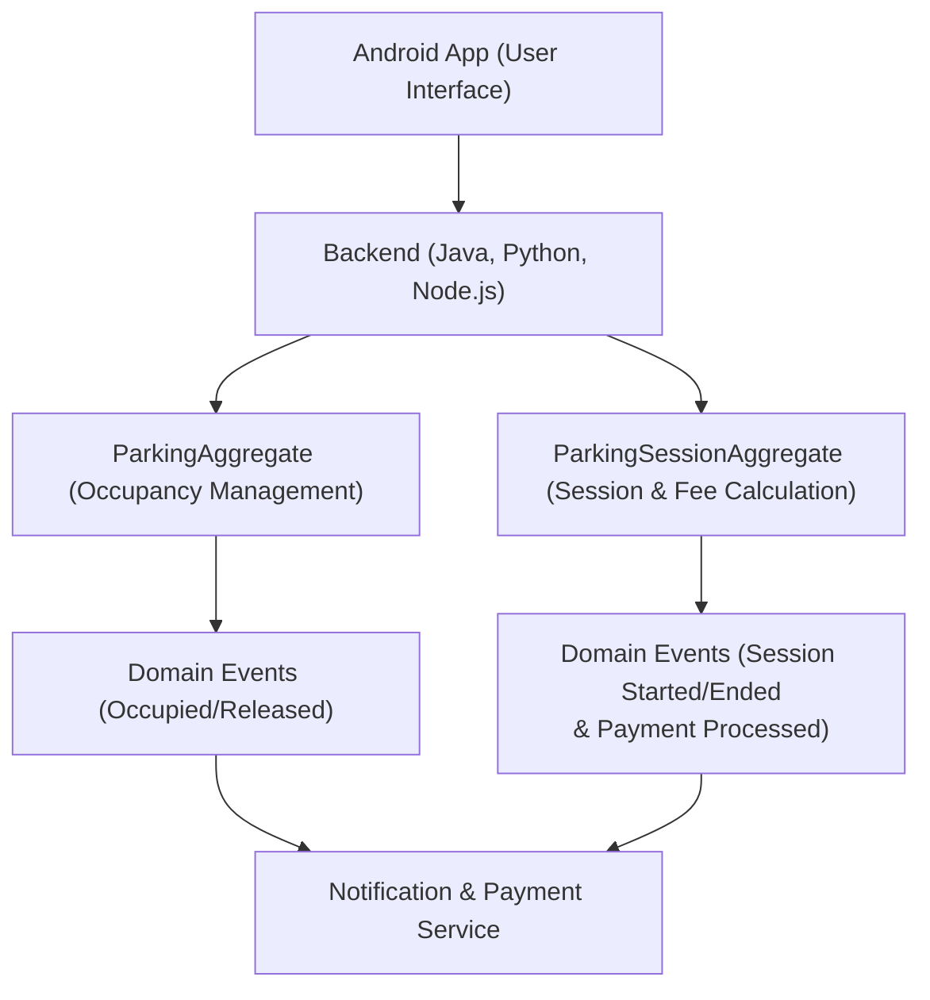

# Smart Parking System

The Smart Parking System is designed to alleviate the stress of finding available parking in enclosed lots. Our solution provides real-time parking information, navigation assistance, and automated vehicle logging through IoT sensors and camera systems. The system integrates a robust backend architecture based on aggregates and domain events to ensure a consistent and scalable solution.

---

## System Overview

- **User Interaction:**
  - **Selection:** Drivers choose a parking lot using an Android app.
  - **Information Display:** The app shows parking lot details including operating hours, occupancy status, available spot count, and the current number of viewers.
  - **Navigation:** Drivers receive real-time directions to the selected parking lot.
  - **Real-time Updates:** Notifications are sent if available parking spots decrease or become fully occupied.

- **On-site Operations:**
  - **Entry Logging:** Upon arrival, our camera system scans the license plate and logs the entry time.
  - **Spot Monitoring:** IoT sensors continuously monitor and update the status of each parking spot, which is visualized on the app.
  - **Exit Process:** When leaving, the camera system scans the license plate again to compute the parking fee, and the spot is marked as available.

---

## Aggregates and Domain Events

Aggregates encapsulate the core business logic and ensure data consistency, while domain events notify different parts of the system about key state changes.

## Aggregates

### 1. User Aggregate

**Responsibilities:**
- User registration and authentication (JWT-based)
- Managing user profiles
- Handling favorite parking lots
- Managing notification preferences
- Storing user parking history

**Key Methods:**
- `registerUser(email, password, name)`: Registers a new user after checking for duplicates and hashing the password.
- `loginUser(email, password)`: Authenticates user and returns JWT and refresh token.
- `addFavoriteParking(userId, parkingId)`: Adds a parking lot to user's favorites.
- `updateNotificationPreferences(userId, preferences)`: Updates how the user receives notifications (push, SMS, email).

---

### 2. ParkingLot Aggregate

**Responsibilities:**
- Managing static parking lot information (name, location, capacity, hours)
- Updating lot details via the admin panel
- Handling real-time occupancy updates from IoT sensors
- Tracking how many users are currently viewing the lot

**Key Methods:**
- `createParkingLot(adminId, parkingData)`: Creates a new parking lot.
- `updateFromSensor(parkingId, sensorData)`: Updates lot occupancy based on sensor input.
- `trackUserView(parkingId)`: Logs a user viewing the parking lot.
- `getViewedUserCount(parkingId)`: Returns the number of users currently viewing the lot.
  
---

### 3. ParkingSpot Aggregate

**Responsibilities:**
- Tracking individual parking spot occupancy
- Providing a visual parking layout in the mobile app

**Key Methods:**
- `getParkingLayout(parkingId)`: Returns all spots with coordinates and occupancy status.
- `getAvailableSpots(parkingId)`: Returns only available spots.

---

### 4. Navigation Aggregate

**Responsibilities:**
- Providing geographic location of parking lots
- Supporting map display with pin locations

**Key Methods:**
- `getParkingLocation(parkingId)`: Returns coordinates for a specific parking lot.
- `getAllParkingLocations()`: Returns all available parking lots with coordinates.

---

### 5. LicensePlateRecord Aggregate

**Responsibilities:**
- Reading and storing license plate data at entry and exit
- Logging timestamps for each entry and exit
- Calculating total parking duration
- Calculating total price

**Key Methods:**
- `logEntry(plateNumber, timestamp)`: Logs vehicle entry.
- `logExit(plateNumber, timestamp)`: Logs vehicle exit and matches it with the entry.
- `calculateParkingDuration(plateNumber)`: Calculates the total time spent in the parking lot.
- `calculateParkingPrice(plateNumber)`: Calculates the total price according the duration of time.

---

### 6. Notification Aggregate

**Responsibilities:**
- Sending notifications via push, SMS, or email
- Handling event-based notification triggers (entry, exit, full lot)

**Key Methods:**
- `sendNotification(userId, message, type)`: Sends a notification through the user's preferred method.
- `notifyParkingFull(parkingId)`: Notifies users viewing the lot that it is now full.

---

### 7. Log & Monitoring Aggregate

**Responsibilities:**
- Capturing and storing system logs
- Tracking service-level metrics
- Triggering alerts for performance or error conditions

**Key Methods:**
- `logEvent(serviceName, level, message)`: Logs events with different severity levels (`INFO`, `WARN`, `ERROR`, `DEBUG`).
- `trackMetric(metricName, value)`: Records metrics like CPU usage, memory, and response times.

---

### 8. ChatbotSession Aggregate

**Responsibilities:**
- Processing natural language queries from users
- Integrating with Gemini API for intelligent responses
- Providing real-time parking recommendations and information

**Key Methods:**
- `processMessage(userId, message)`: Interprets and responds to user queries.
- `getSuggestedParkings(location)`: Suggests nearby parking lots based on user's location.
- `getParkingDetails(parkingId)`: Returns availability, pricing, and operating hours for a lot.

## Domain Events

This section describes the domain events emitted by various aggregates in the Smart Parking System. Each event includes:

- **When it's triggered**
- **Where/how it's used** in the system

---

### 1. User Aggregate Events

### UserRegistered

**Triggered when:**  
A user successfully completes the registration process.

**Usage:**
- Send a notification (email, push)
- Track registration metrics for analytics
- Initialize default user settings/preferences

---

### UserLoggedIn

**Triggered when:**  
A user logs into the mobile app.

**Usage:**

- Enable real-time user activity tracking

---

### FavoriteParkingAdded

**Triggered when:**  
A user adds a parking lot to their favorites.

**Usage:**
- Update UI for quick access to saved lots
- Improve user experience with faster searches

---

### 2. ParkingLot Aggregate Events

### ParkingLotCreated

**Triggered when:**  
An admin adds a new parking lot to the system.

**Usage:**
- Display the lot on the map
- Notify stakeholders about the new lot

---

### OccupancyUpdated

**Triggered when:**  
Sensor data updates spot availability in a parking lot.

**Usage:**
- Refresh parking availability in the mobile app
- Trigger full/empty status alerts to users
- Update real-time dashboards
- Support analytics for peak times and usage

---

### ParkingLotViewed

**Triggered when:**  
A user opens the parking lot detail page.

**Usage:**
- Log demand and interest for specific lots
- Enable graphics for user traffic analysis

---

### 3. ParkingSpot Aggregate Events

### ParkingLayoutFetched

**Triggered when:**  
A user opens the layout/map view of a parking lot.

**Usage:**
- Support UI layout

---

### 4. LicensePlateRecord Aggregate Events

### VehicleEntered

**Triggered when:**  
A vehicle is recognized at the parking lot entrance.

**Usage:**
- Start tracking the parking session
- Log the session for future billing

---

### VehicleExited

**Triggered when:**  
A vehicle is recognized at the parking lot exit.

**Usage:**
- End the parking session
- Trigger duration and billing processes

---

### ParkingDurationCalculated

**Triggered when:**  
The system calculates the duration between entry and exit.

**Usage:**
- Provide data for payment calculation

---

### 5. Notification Aggregate Events

### NotificationSent

**Triggered when:**  
A notification is successfully sent to a user.

**Usage:**
- Send notification about parking availability

---

### 6. Log & Monitoring Aggregate Events

### ServiceHealthCheckPassed / Failed

**Triggered when:**  
A service passes or fails its scheduled health check.

**Usage:**
- Update system status dashboards
- Trigger automated recovery or alerts
- Notify DevOps teams of incidents
- Log historical uptime for reporting

---

### ErrorLogged

**Triggered when:**  
An error occurs in any microservice.

**Usage:**
- Store contextual error data for debugging
- Send alert notifications to developers
- Feed error tracking dashboards
- Measure error frequency and trends

---

### 7. ChatbotSession Aggregate Events

### UserMessageReceived

**Triggered when:**  
A user sends a message to the chatbot.

**Usage:**
- Pass the input to the NLP/AI engine
- Log chat history for context and analytics
- Detect user intent and start relevant workflows
- Train and improve chatbot accuracy

---

### ChatbotResponseSent

**Triggered when:**  
The chatbot responds to a user query.

**Usage:**
- Complete the user-chat flow
- Log the response for feedback analysis
- Support chatbot performance tracking

---

## Conclusion

This architecture provides a clear, scalable, and modular approach to managing parking operations. By using aggregates to encapsulate business logic and domain events to propagate state changes, our system ensures real-time updates and robust data consistency across all services.

Feel free to modify this document as your project evolves.
